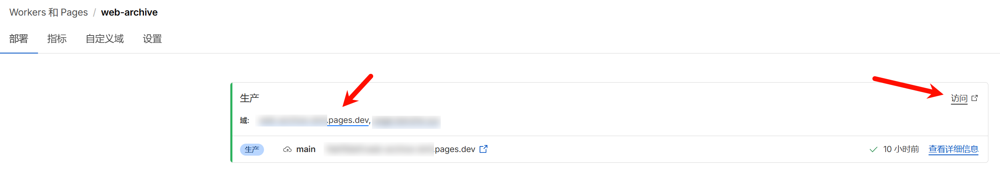

## GitHub Actions 部署

### 1. 在 GitHub 上 Fork 本项目

先将本项目 Fork 到自己的 GitHub 账号下，后续的部署配置和工作流运行都在 Fork 后的仓库中完成。

### 2. 准备 Cloudflare 凭据

你需要在 Cloudflare 中准备以下两个 GitHub Actions Secrets：

- `CLOUDFLARE_ACCOUNT_ID`：Cloudflare 账号 ID，可参考 [Find account and zone IDs · Cloudflare Fundamentals docs](https://developers.cloudflare.com/fundamentals/account/find-account-and-zone-ids/) 获取。
- `CLOUDFLARE_API_TOKEN`：用于 GitHub Actions 调用 Cloudflare API 的令牌，可在 [API 令牌 | Cloudflare](https://dash.cloudflare.com/profile/api-tokens) 页面创建。

> [!IMPORTANT]
> `R2` 功能需要先在 Cloudflare 面板中手动开通。请在开通后再进行部署；如果首次运行失败，开通后重新运行 GitHub Actions workflow 即可。
> 这里只需要开通 `R2` 功能，不需要手动创建存储桶，部署时会自动创建 `web-archive` 存储桶。

> [!NOTE]
> 创建令牌时，直接选择 `编辑 Cloudflare Workers` 模板，再手动添加 `D1 编辑` 权限。
> 账户资源选择“所有账户”，区域资源选择“所有区域”即可。

Cloudflare API 令牌权限配置可参考下图：


### 3. 在 Fork 仓库中配置 GitHub Actions Secrets

进入 Fork 仓库的 `Settings -> Secrets and variables -> Actions` 页面，分别创建以下两个仓库 Secret：

- `CLOUDFLARE_ACCOUNT_ID`
- `CLOUDFLARE_API_TOKEN`

Secrets 配置页面如下：


### 4. 启用 GitHub Actions 并运行部署 workflow

进入 Fork 仓库的 `Actions` 页面；如果 GitHub 提示该 Fork 仓库的 Actions 尚未启用，先点击启用。


启用后，在工作流列表中选择 `Deploy`，再点击 `Run workflow` 手动触发部署。


> [!IMPORTANT]
> 部署后请尽快登录，首个登录的用户会被设置为管理员。

部署完成后，可以在 Cloudflare Workers 页面中找到服务的访问链接。访问时请使用不带 hash 的正式链接，不要复制带随机 hash 的预览链接。


## 命令部署

要求本地已安装 Node 环境。
命令部署的更新流程相对更繁琐，推荐优先使用 GitHub Actions 部署。
### 0. 下载代码
在 release 页面下载最新的 service.zip，解压后在根目录执行后续操作。

### 1. 登录
```bash
npx wrangler login
```

### 2. 创建 r2 存储桶
```bash
npx wrangler r2 bucket create web-archive
```
成功输出：
```bash
 ⛅️ wrangler 3.78.10 (update available 3.80.4)
--------------------------------------------------------

Creating bucket web-archive with default storage class set to Standard.
Created bucket web-archive with default storage class set to Standard.
```

### 3. 创建 d1 数据库
```bash
# 创建数据库
npx wrangler d1 create web-archive
```

执行输出：

```bash
 ⛅️ wrangler 3.78.10 (update available 3.80.4)
--------------------------------------------------------

✅ Successfully created DB 'web-archive' in region UNKNOWN
Created your new D1 database.

[[d1_databases]]
binding = "DB" # i.e. available in your Worker on env.DB
database_name = "web-archive"
database_id = "xxxx-xxxx-xxxx-xxxx-xxxx"
```
拷贝最后一行，替换 `wrangler.toml` 文件中 `database_id` 的值。  

然后执行初始化 sql:
```bash
npx wrangler d1 migrations apply web-archive --remote
```

成功输出：
```bash
🌀 Executing on remote database web-archive (7fd5a5ce-79e7-4519-a5fb-2f9a3af71064):
🌀 To execute on your local development database, remove the --remote flag from your wrangler command.
Note: if the execution fails to complete, your DB will return to its original state and you can safely retry.
├ 🌀 Uploading 7fd5a5ce-79e7-4519-a5fb-2f9a3af71064.0a40ff4fc67b5bdf.sql
│ 🌀 Uploading complete.
│
🌀 Starting import...
🌀 Processed 9 queries.
🚣 Executed 9 queries in 0.00 seconds (13 rows read, 13 rows written)
   Database is currently at bookmark 00000001-00000005-00004e2b-c977a6f2726e175274a1c75055c23607.
┌────────────────────────┬───────────┬──────────────┬────────────────────┐
│ Total queries executed │ Rows read │ Rows written │ Database size (MB) │
├────────────────────────┼───────────┼──────────────┼────────────────────┤
│ 9                      │ 13        │ 13           │ 0.04               │
└────────────────────────┴───────────┴──────────────┴────────────────────┘
```

### 4. 部署服务
```bash
# 部署服务
npx wrangler pages deploy
```

成功输出：
```bash
The project you specified does not exist: "web-archive". Would you like to create it?
❯ Create a new project
✔ Enter the production branch name: … dev
✨ Successfully created the 'web-archive' project.
▲ [WARNING] Warning: Your working directory is a git repo and has uncommitted changes

  To silence this warning, pass in --commit-dirty=true

🌎  Uploading... (3/3)

✨ Success! Uploaded 3 files (3.29 sec)

✨ Compiled Worker successfully
✨ Uploading Worker bundle
✨ Uploading _routes.json
🌎 Deploying...
✨ Deployment complete! Take a peek over at https://web-archive-xxxx.pages.dev
```

## 如何更新

使用 GitHub Actions 部署时，会自动创建一个 Fork 仓库，更新时只需要执行 Sync fork 即可。

命令部署时，需要下载最新的代码并手动更新。
