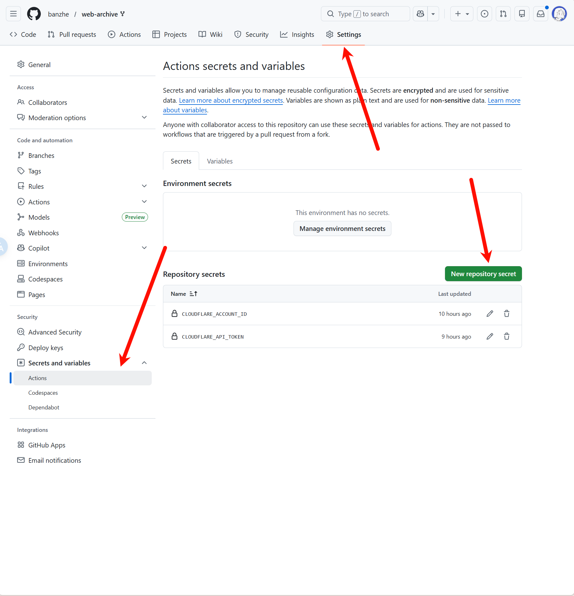
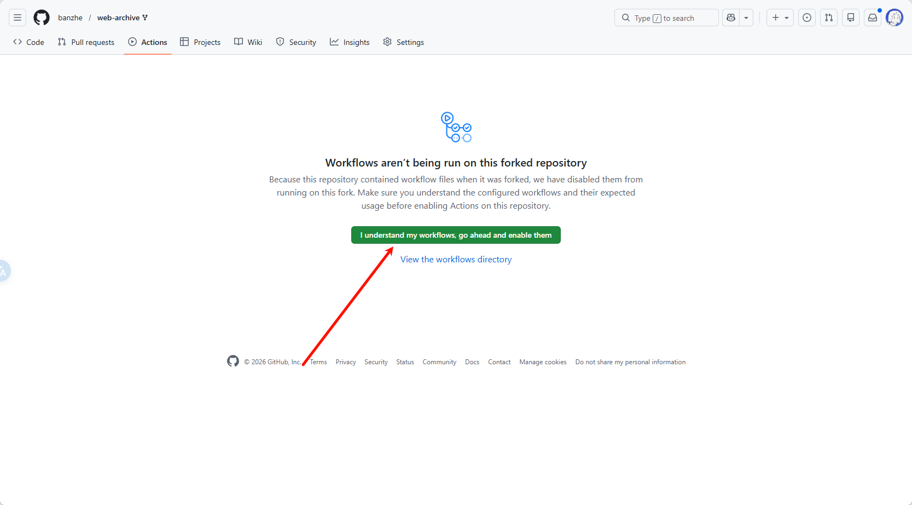
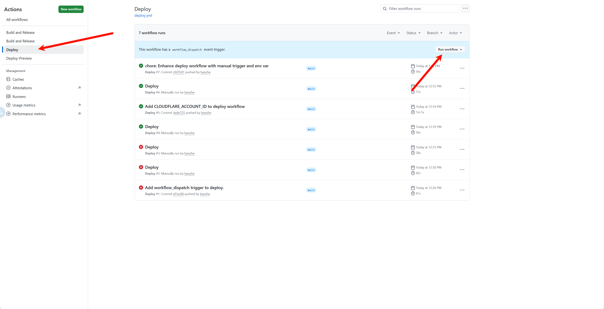
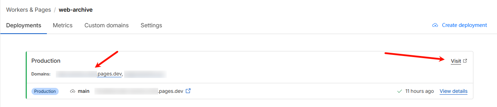

## GitHub Actions Deployment  
  
### 1. Fork this repository on GitHub  
  
First, fork this repository to your own GitHub account. The deployment configuration and workflow runs will be done in your forked repository.  
  
### 2. Prepare Cloudflare credentials  
  
You need to prepare the following two GitHub Actions secrets in Cloudflare:  
  
- `CLOUDFLARE_ACCOUNT_ID`: Your Cloudflare account ID. See [Find account and zone IDs - Cloudflare Fundamentals docs](https://developers.cloudflare.com/fundamentals/account/find-account-and-zone-ids/) for how to find it.  
- `CLOUDFLARE_API_TOKEN`: A token used by GitHub Actions to call the Cloudflare API. You can create it on the [API Tokens | Cloudflare](https://dash.cloudflare.com/profile/api-tokens) page.  
  
> [!IMPORTANT]  
> The `R2` feature must be enabled manually in the Cloudflare dashboard before deployment. If the first workflow run fails because `R2` is not enabled yet, enable it and rerun the GitHub Actions workflow.  
> You only need to enable the `R2` feature. You do not need to create the bucket manually. The deployment will create the `web-archive` bucket automatically.  
  
> [!NOTE]  
> When creating the token, choose the `Edit Cloudflare Workers` template first, then manually add the `D1 Edit` permission.  
> Set Account Resources to "All accounts" and Zone Resources to "All zones".  
  
For reference, the Cloudflare API token permissions should look like this:  
  
  
  
### 3. Configure GitHub Actions secrets in your fork  
  
Go to `Settings -> Secrets and variables -> Actions` in your forked repository, then create these two repository secrets:  
  
- `CLOUDFLARE_ACCOUNT_ID`  
- `CLOUDFLARE_API_TOKEN`  
  
The Secrets configuration page looks like this:  
  
  
  
### 4. Enable GitHub Actions and run the deployment workflow  
  
Open the `Actions` page in your forked repository. If GitHub shows that Actions are disabled for the fork, enable them first.  
  
  
  
After Actions are enabled, select the `Deploy` workflow from the workflow list, then click `Run workflow` to trigger deployment manually.  
  
  
  
> [!IMPORTANT]  
> After deployment, log in as soon as possible. The first user to log in will be assigned as the administrator.  
  
After deployment finishes, you can find the service URL in the Cloudflare Workers dashboard. Use the formal URL without a hash, and do not copy the preview URL with a random hash.  
  
  
  
## Command Deploy

Requirements: Local installation of node environment.  
Command deployment is more troublesome to update, so it is recommended to use Github Actions deployment.  

### 0. Download the code
Download the latest service.zip from the release page, unzip it, and execute the following commands in the root directory.

### 1. Login
```bash
npx wrangler login
```

### 2. Create R2 storage bucket
```bash
npx wrangler r2 bucket create web-archive
```

Success output:
```bash
 ⛅️ wrangler 3.78.10 (update available 3.80.4)
--------------------------------------------------------

Creating bucket web-archive with default storage class set to Standard.
Created bucket web-archive with default storage class set to Standard.
```

### 3. Create D1 database
```bash
npx wrangler d1 create web-archive
```

Success output:
```bash
✅ Successfully created DB 'web-archive' in region UNKNOWN
Created your new D1 database.

[[d1_databases]]
binding = "DB" # i.e. available in your Worker on env.DB
database_name = "web-archive"
database_id = "xxxx-xxxx-xxxx-xxxx-xxxx"
```

Copy the last line of the output, replace the `database_id` value in the `wrangler.toml` file.

Then execute the following command to initialize the database:
```bash
npx wrangler d1 migrations apply web-archive --remote
```

Success output:
```bash
🌀 Executing on remote database web-archive (7fd5a5ce-79e7-4519-a5fb-2f9a3af71064):
🌀 To execute on your local development database, remove the --remote flag from your wrangler command.
Note: if the execution fails to complete, your DB will return to its original state and you can safely retry.
├ 🌀 Uploading 7fd5a5ce-79e7-4519-a5fb-2f9a3af71064.0a40ff4fc67b5bdf.sql
│ 🌀 Uploading complete.
│
🌀 Starting import...
🌀 Processed 9 queries.
🚣 Executed 9 queries in 0.00 seconds (13 rows read, 13 rows written)
   Database is currently at bookmark 00000001-00000005-00004e2b-c977a6f2726e175274a1c75055c23607.
┌────────────────────────┬───────────┬──────────────┬────────────────────┐
│ Total queries executed │ Rows read │ Rows written │ Database size (MB) │
├────────────────────────┼───────────┼──────────────┼────────────────────┤
│ 9                      │ 13        │ 13           │ 0.04               │
└────────────────────────┴───────────┴──────────────┴────────────────────┘
```

### 4. Deploy service
```bash
npx wrangler pages deploy
```

Success output:

成功输出：
```bash
The project you specified does not exist: "web-archive". Would you like to create it?
❯ Create a new project
✔ Enter the production branch name: … dev
✨ Successfully created the 'web-archive' project.
▲ [WARNING] Warning: Your working directory is a git repo and has uncommitted changes

  To silence this warning, pass in --commit-dirty=true

🌎  Uploading... (3/3)

✨ Success! Uploaded 3 files (3.29 sec)

✨ Compiled Worker successfully
✨ Uploading Worker bundle
✨ Uploading _routes.json
🌎 Deploying...
✨ Deployment complete! Take a peek over at https://web-archive-xxxx.pages.dev
```

## How to update

Use Github Actions deployment, the latest code will be automatically synced to the fork repository.

Command deployment needs to download the latest code and update manually.